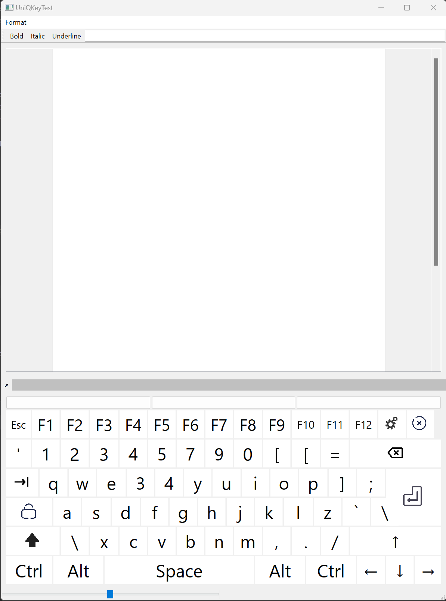

# UniQKey
Alternative Cross-Platform On-Screen Keyboard for Qt5 and Qt6



## How to build

```
mkdir build
cmake ..
cmake --build .
```

Install with : 

```
cmake --install .
```

## Usage

To link with cmake : 
```cmake
find_package(UniQKey REQUIRED)
target_link_libraries(myapp PRIVATE UniQKey::UniQKey)
```

With autotools, link to the library `libUniQKey.a` or `libUniQKey.lib`.

To create a floating keyboard that will show up when a widget is focused, use the following code:
```cpp
#include <UniQKey/UniQKey>

QWidget *anyWidget = ...;
UniQKey::VirtualKeyboard *keyboard = new VirtualKeyboard(mTextEditor);
```

If you don't want the keyboard to float, you can add it whenever you want to your widget's layout:
```cpp
anyWidget->layout()->addWidget(keyboard);
```

And that's this simple !!